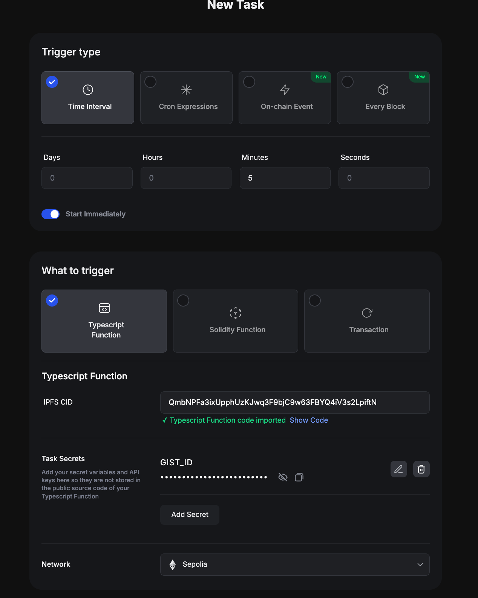
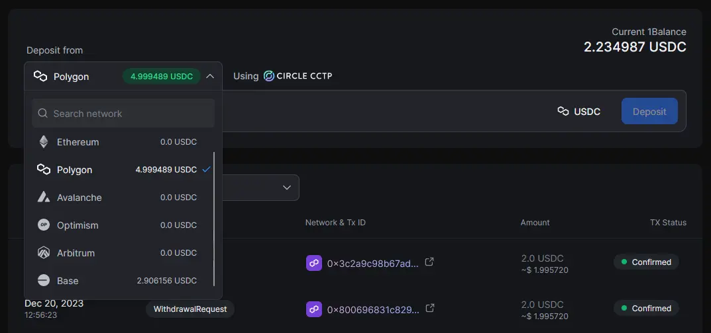
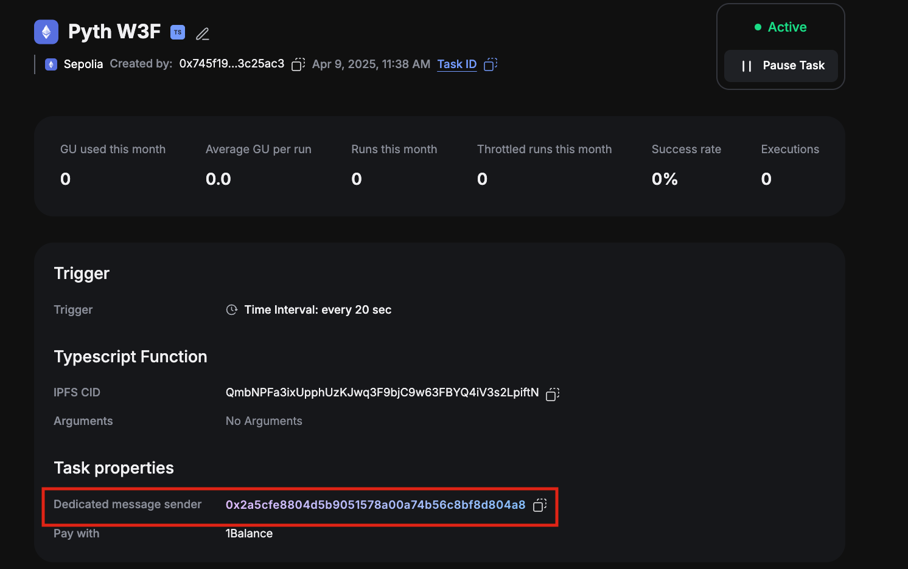

# Gelato Web3 functions <<-->> Pyth PoC

Gelato Web3 Functions together with Pyth offer the ability to create fine-tuned customized oracles pushing prices on-chain following predefined logic within the Web3 Function and verifying prices on-chain through the Pyth network.

## Steps

1. Join Gelato Web3 Functions whitelist
   Web3 functions like Solidity functions and automated transactions can be used directly. However, to use TypeScript-based Web3 Functions, you must be added to the whitelist. To apply, please reach out to the Gelato team for access [here](https://discord.com/invite/ApbA39BKyJ).

2. Configure your task
   The Gelato task reads a yaml configuration file from a GitHub gist. Create a GitHub gist by logging into GitHub and navigating to [here](https://gist.github.com/). Add a file called config.yaml. Copy the [example gist](https://gist.github.com/swimricky/18b2a5ad9c1a605f1cf5c19ac1d2f1d9) and edit the parameters for the environment you're deploying to and configure your price feeds and update thresholds. See [directory](https://github.com/pyth-network/w3f-pyth-poc-v2/tree/master/web3-functions/pyth-oracle-w3f-priceIds) for some example configuration files. These parameters can be updated at any time by editing the gist even if the task has already been deployed. The task will automatically pick up these configuration changes and use them for subsequent executions.

   

3. Create the task
   Use the link below to auto-populate the task parameters with the Pyth web3 function code: https://app.gelato.network/new-task?cid=QmbNPFa3ixUpphUzKJwq3F9bjC9w63FBYQ4iV3s2LpiftN

   The pyth web3 function code is deployed to IPFS, so you can use it via the cid/link above. You can find a copy of the web3 function code here.

   Choose network, and then in the "Task secrets" section, set GIST_ID to the gistId of the gist you created in step 2.



4. Funding

We will fund Gelato and Pyth following this process:

1. Gelato:
   The gelato fees are payed with [1Balance](https://docs.gelato.network/web3-services/1balance).
   1Balance allows to deposit USDC on polygon and run the transactions on every network.

   Once you are whitelisted, visit the 1Balance section on [Gelato app](https://app.gelato.network) and deposit USDC on Polygon to top up your Gelato balance which will be used to pay the Gelato fees on all supported chains. These include computational costs and transaction gas fees. Testnet executions are subsidized by Gelato and free. Note : You can deposit USDC from any chain supported by Circle CCTP.

- Deposit USDC

    

2. Pyth:
   The method that updates the price is payable, the update transaction has to include in the msg.value the corresponding fee:

```ts
    /// @notice Update price feeds with given update messages.
    /// This method requires the caller to pay a fee in wei; the required fee can be computed by calling
    /// `getUpdateFee` with the length of the `updateData` array.
    /// Prices will be updated if they are more recent than the current stored prices.
    /// The call will succeed even if the update is not the most recent.
    /// @dev Reverts if the transferred fee is not sufficient or the updateData is invalid.
    /// @param updateData Array of price update data.
    function updatePriceFeeds(bytes[] calldata updateData) external payable;
```

In our two demos we will transfer the fee differently:

- W3F update pyth network  
  The on-chain transaction executed via a web3 function gets routed through a proxy smart contract which is solely owned by the web3 function task creator. This dedicatedMsgSender proxy contract will be deployed with the first task created and will ultimately be responsible for transferring the fee to the Pyth contract.

  The address can be seen in your task dashboard (i.e [example task dashboard](https://app.gelato.network/functions/task/0xbe77f2a9a6d7bf1e6e79ade0864ce4771b5f75ed2812ddcbfaecc5f2e755cadd:1))

   

  Once we have the [dedicatedMsgSender](https://sepolia.etherscan.io/address/0x2a5cfe8804d5b9051578a00a74b56c8bf8d804a8) address we will have to fund it for paying the fees.
  In our example we have sent funds to the dedicated MsgSender with this [transaction](https://sepolia.etherscan.io/tx/0x06d49933f8f0ca15808ca335568f6fd43c575fc09e83e8c009559789f3285e66)

  Once the dedicatedMsgSender is funded, the Web3 Function will execute passing the fee as value in the callData:

  ```ts
  return {
    canExec: true,
    callData: [
      {
        to: pythNetworkAddress,
        data: callData,
        value: fee,
      },
    ],
  };
  ```

## Development

### How to run

1. Install project dependencies:

```
yarn install
```

2. Create a `.env` file with your private config:

```
cp .env.example .env
```

You will need to input your `PROVIDER_URLS`, your RPC.

3. Test the web3 function

W3F Pyth

```
npx w3f test web3-functions/pyth-oracle-w3f-priceIds/index.ts --logs
```

4. Deploy the web3 function on IPFS

W3F Pyth

```
npx w3f deploy web3-functions/pyth-oracle-w3f-priceIds/index.ts
```

5. Create the task following the link provided when deploying the web3 to IPFS in our case:

W3F Pyth

```
 ✓ Web3Function deployed to ipfs.
 ✓ CID: QmbNPFa3ixUpphUzKJwq3F9bjC9w63FBYQ4iV3s2LpiftN

To create a task that runs your Web3 Function every minute, visit:
> https://app.gelato.network/new-task?cid=QmbNPFa3ixUpphUzKJwq3F9bjC9w63FBYQ4iV3s2LpiftN
```

You can find a template/instructions for W3F Pyth with dynamic configuration values loaded from a Github gist that allows you to update priceIds and various parameters without having to re-deploy the task in `web3-functions/pyth-oracle-w3f-priceIds`.

### W3F command options

- `--logs` Show internal Web3Function logs
- `--runtime=thread|docker` Use thread if you don't have dockerset up locally (default: thread)
- `--debug` Show Runtime debug messages
- `--chain-id=number` Specify the chainId (default is Goerli: 5)

Example: `npx w3f test web3-functions/pyth-oracle-w3f-priceIds/index.ts --logs --debug`
